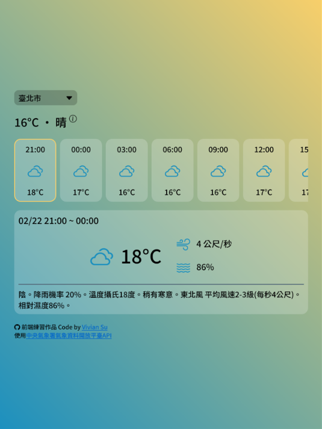

# Weather App

Build a weather forecast page using JavaScript.

使用中央氣象署氣象資料開放平臺 API，提供各縣市自動氣象站觀測資料，以及以 3 小時為間隔的氣象預報。可切換縣市與切換預報時間區段，顯示更詳細資料。

## Table of contents

-   [Table of contents](#table-of-contents)
-   [Overview](#overview)
    -   [The challenge](#the-challenge)
    -   [Screenshot](#screenshot)
    -   [Links](#links)
-   [My process](#my-process)
    -   [Built with](#built-with)
    -   [What I learned](#what-i-learned)
    -   [Useful resources](#useful-resources)
-   [Author](#author)

## Overview

### The challenge

Users should be able to:

-   View the optimal layout for the site depending on their device's screen size
-   See hover states for all interactive elements on the page
-   Switch different city
-   See all weather forecast in a horizontal slider
-   Switch different forecast period

### Screenshot



### Links

-   Live Site URL: [https://yj-weather.netlify.app/](https://yj-weather.netlify.app/)

## My process

### Built with

-   Semantic HTML5 markup
-   sass/SCSS
-   Bootstrap Icons
-   Mobile-first workflow
-   JavaScript
-   Webpack
-   Google Fonts
-   Netlify

### What I learned

-   Use SCSS @mixin

```css
@mixin flexCenter {
    display: flex;
    justify-content: center;
    align-items: center;
}

@mixin mq($size) {
    @media screen and (min-width: $size) {
        @content;
    }
}
```

-   Use JavaScript module

```js
import { CITYDATA } from "./constants";
import {
    loadCityOption,
    updateWeatherObserve,
    updateHourlyForecast,
} from "./domFunctions";
import {
    getWeatherObserveFromApi,
    getHourlyForecastFromApi,
} from "./dataFunctions";
```

-   Use JavaScript to manipulate DOM

```js
const weatherObserveDisplay = (data) => {
    const weatherTemp = document.getElementById("weatherObserve__temp");
    const informBtn = weatherTemp.nextElementSibling;

    weatherTemp.innerHTML = data;
    if (informBtn.classList.contains("none")) {
        informBtn.classList.remove("none");
    }
};

const deleteContent = (container) => {
    let child = container.lastElementChild;
    while (child) {
        container.removeChild(child);
        child = container.lastElementChild;
    }
};

const getWeatherForecastDisplay = (index) => {
    ...

    // weatherForecast__content
    const forecastContent = createElem("div", "weatherForecast__content");
    forecastContent.append(title, forecastBox, createElem("hr"), description);

    return forecastContent;
};
```

-   Use fetch to receive data from API

```js
export const getWeatherObserveFromApi = async (station) => {
    const url = `https://opendata.cwa.gov.tw/api/v1/rest/datastore/O-A0001-001?Authorization=${APPKEY}&StationId=${station}`;

    let data = {};
    let error = "";
    try {
        const response = await fetch(url);
        if (!response.ok) {
            throw new Error(response.statusText);
        }

        data = await response.json();
    } catch (err) {
        error = err.message;
    }

    return { data, error };
};
```

-   Use Webpack to bundle modules

```js
const path = require("path");
const MiniCssExtractPlugin = require("mini-css-extract-plugin");
const HtmlWebpackPlugin = require("html-webpack-plugin");

module.exports = {
    mode: "development",
    devtool: "source-map",
    entry: "./src/js/main.js",
    output: {
        path: path.resolve(__dirname, "dist"),
        filename: "js/main.bundle.js",
    },
    plugins: [
        new MiniCssExtractPlugin({
            filename: "css/style.css",
        }),
        new HtmlWebpackPlugin({
            template: "./src/index.html",
            filename: "index.html",
        }),
    ],

    ...
};
```

### Useful resources

-   [中央氣象署開放資料平臺之資料擷取 API](https://opendata.cwa.gov.tw/dist/opendata-swagger.html?urls.primaryName=openAPI#/%E9%A0%90%E5%A0%B1/get_v1_rest_datastore_F_D0047_089)
-   [Build a Weather App with Vanilla Javascript](https://www.youtube.com/watch?v=s_Ie_yh_4Co&list=PL0Zuz27SZ-6PA3nkkEAr91n4bK-NunwPU&index=1)
-   [Webpack 5 Crash Course](https://www.youtube.com/watch?v=IZGNcSuwBZs)

## Author

-   GitHub - [@YingJhen-Su](https://github.com/YingJhen-Su)
-   freeCodeCamp - [@YJS](https://www.freecodecamp.org/YJS)
-   CodePen - [@YJ1997](https://codepen.io/YJ1997)
-   Frontend Mentor - [@YingJhen-Su](https://www.frontendmentor.io/profile/YingJhen-Su)
